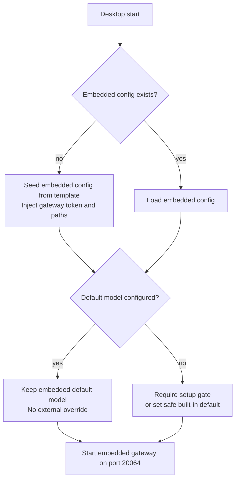
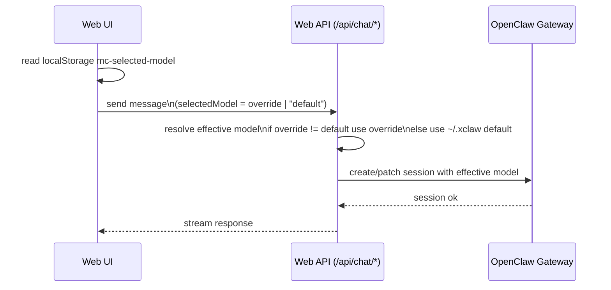
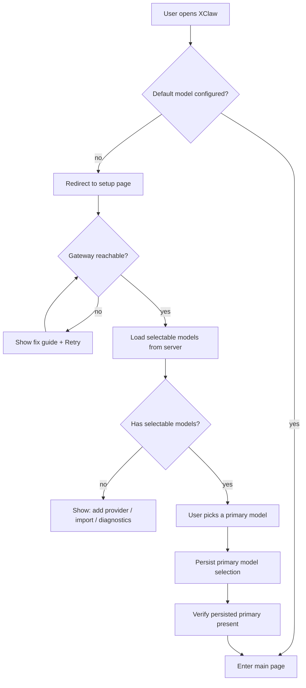

# 模型选择与默认模型持久化（xclaw）

## 背景

当前 `xclaw` 运行时存在两套模型相关状态：

- **OpenClaw 嵌入式实例**：`~/.xclaw/openclaw.json`（以及 `~/.xclaw/agents/main/agent/*`）
- **外部 OpenClaw 实例**：`~/.openclaw/openclaw.json`
- **Web UI 临时选择**：聊天输入框的模型下拉，当前实现会写入浏览器 `localStorage`（例如 `mc-selected-model`）

桌面端启动过程中会对 `~/.xclaw/openclaw.json` 做“种子/补丁”写入，其中包含将 `~/.openclaw/openclaw.json` 的 `agents.defaults.model.primary` 迁移到 `~/.xclaw` 的逻辑。这会造成：

- 用户在 `xclaw` 内选择/保存的默认模型可能被外部实例的默认值“隐式影响”
- 对新用户来说，默认模型来源不透明（“为什么启动后变成某个模型”）
- 聊天页的“临时选择”和“系统默认”容易混淆

本 RFD 目标是明确“模型选择”的层级、持久化语义、以及外部实例的导入策略。

## 目标

- 明确并实现**两层模型选择语义**：
  - **系统默认模型（持久化）**：用于“未指定模型”的默认落点
  - **会话/单次发送模型（临时覆盖）**：仅影响当前会话/当前发送
- 嵌入式实例（`~/.xclaw`）的默认模型**由 xclaw 自己管理**，不被外部 `~/.openclaw` 长期隐式覆盖
- 外部实例的模型/凭据导入应当**可控、可感知、可回滚**

## 非目标

- 不改变 OpenClaw 内核的 model schema
- 不要求聊天页的临时选择必须写回系统默认（避免“试用即改默认”）
- 不自动修改外部 `~/.openclaw/openclaw.json`

## 现状梳理（问题定位）

### 现状：桌面端迁移外部 `primary`

桌面端会在启动时确保 `~/.xclaw/openclaw.json` 存在，并在内置配置未设置 `agents.defaults.model.primary` 时读取外部 `~/.openclaw/openclaw.json` 的 `primary` 作为嵌入式默认值。

风险：这会让嵌入式实例的默认模型来源不透明，且在“用户期望 xclaw 自己管理默认模型”的前提下不合理。

### 现状：Web UI 临时选择（localStorage）

聊天输入框的模型选择是 UI 侧的偏好记忆（`localStorage`），并作为请求参数传入消息发送/会话创建逻辑。

风险：该状态是浏览器/窗口级别的；若把它当作系统默认写入 `~/.xclaw/openclaw.json`，会引入多窗口争用与难以解释的行为。

## 术语

- **Default（系统默认）**：写入 `~/.xclaw/openclaw.json -> agents.defaults.model.primary`，持久化生效
- **Override（临时覆盖）**：聊天页面选择，用于会话/消息级覆盖，不改变 Default
- **Conversation（左侧会话项）**：Web UI 左侧列表中的一条对话记录，`id` 为前端/本地库的会话主键
- **Gateway Session（OpenClaw 会话）**：OpenClaw Gateway 内的 session（具备 session key、label、history 等）

## 设计补充：左侧会话栏为何与 OpenClaw Session 1:1 绑定

### 映射约定（`gw:`）

对「走网关」的聊天会话，XClaw 采用如下约定把 UI 会话与 OpenClaw session 绑定：

- **左侧会话 `Conversation.id`** 使用 `gw:<sessionKey>` 格式
- 其中 `<sessionKey>` 为 OpenClaw Gateway 的 canonical session key（例如 `agent:main:ui-xxxxxxxxxxxxxxxx`）
- 因此：**`Conversation.id` 去掉 `gw:` 前缀后，就是网关 session key**；本地消息表亦以相同 `conversation_id` 关联

### 为什么要这样设计

- **稳定的跨层标识**：UI 列表、SQLite 本地消息、以及 Gateway 的 history/label 操作需要共享同一个“会话锚点”。用 `gw:<sessionKey>` 可以在不额外维护映射表的前提下，把三者稳定对齐。
- **显式区分数据来源**：`gw:` 前缀把“网关会话”与“仅本地/占位会话”（例如网关不可用时的临时项）区分开，避免把不同来源的会话混在同一套语义里。
- **支持会话级能力同步**：侧栏重命名会调用 `sessions.patch` 写入网关 label。若 UI 侧 id 与 session key 不一致，会导致“改了本地标题但网关不跟随”或反之，出现难解释的分叉。
- **避免“创建先后与落库竞态”**：新建网关会话时可能尚无首条消息落库，但侧栏需要立即显示可点击项。以 `gw:<sessionKey>` 作为主键可以先显示、后补消息；同时可在网关已删除但本地仍残留时，通过校验与收敛逻辑移除“幽灵项”。

### 与模型选择（Default/Override）的关系

采用 `gw:<sessionKey>` 的 1:1 映射后，模型选择语义可以清晰分层：

- **Default（系统默认）**：影响“新建 Gateway Session/未显式 override 的消息发送”时的默认模型落点
- **Override（临时覆盖）**：作为请求参数作用于某次发送或某个会话，但不会改变 Default
- **会话级元信息（label、history、usage）**：通过 `sessionKey` 直接与网关交互，不依赖额外的 UI-only 映射

## 方案（推荐）

### 1) 系统默认模型：只由“设置页”写入

- UI：`/settings/management/models`（模型管理页）
- API：`/api/openclaw/models` 的 `PATCH`（设置 primary）与 `POST`（保存 provider）
- 落盘：写入 `~/.xclaw/openclaw.json` 与 `~/.xclaw/agents/main/agent/{models.json, model.json, auth-profiles.json}`（按现有 store 行为）

语义：当用户在设置页点击保存默认模型时，才改变 Default。

### 2) 聊天临时选择：只覆盖会话/消息

- UI：聊天输入框下拉（`mc-selected-model`）
- 行为：作为请求参数覆盖 Default，用于当前会话/单次发送
- 不写回 `~/.xclaw/openclaw.json`，避免“试用即改默认”

### 3) 外部 `~/.openclaw`：改为“显式导入”，而非隐式迁移

将“读取外部 `agents.defaults.model.primary` 并写回 `~/.xclaw`”改为：

- **默认不导入模型 primary**
- 可选提供一个显式动作（按钮/命令）：
  - “从外部 OpenClaw 导入模型配置/凭据”
  - 导入范围建议拆分：
    - 仅导入 `auth-profiles.json`（最常用、风险低）
    - 导入 provider blocks（需要合并策略）
    - 导入 default primary（谨慎，需用户确认）

如果产品必须保留“首次安装自动兜底”，也应收敛为：

- 仅在真正“首次 seed”时执行一次（例如：`~/.xclaw/openclaw.json` 不存在且由模板刚创建）
- 执行后记录一次性标记（例如写入 `meta.migratedFromOpenclawAt`），后续不再自动覆盖

### 4) 强制模型选择（Setup Gate，不可跳过/不可退出）

当 **系统默认模型未配置**（或用户从未选择过）时，`xclaw` 必须进入一个强制 Setup 流程，完成后才允许进入主页面与创建会话。

#### 触发条件（任一满足即进入 Gate）

- `~/.xclaw/openclaw.json` 不存在或无法解析
- `~/.xclaw/openclaw.json -> agents.defaults.model.primary` 为空
- `~/.xclaw/agents/main/agent/models.json` 不存在或无可用模型列表（无法呈现可选项）

#### 交互与约束

- **不可跳过**：未完成选择，不允许进入主页面（路由层强制重定向到 Setup）
- **不可退出**：不提供“关闭/跳过/以后再说”入口（除非直接退出整个应用进程）
- **双重保护**：
  - 前端路由守卫：未配置默认模型时，所有主页面路由强制跳转到 Setup
  - 后端创建会话保护：若未配置默认模型且请求未显式指定 override，则返回明确错误码/文案，提示先完成 Setup

#### Setup 页面流程（推荐）

1. **检查网关可用性**
   - 若网关不可用：提示修复（例如安装 runtime 依赖、检查端口），提供“重试”
2. **加载可选模型列表**
   - 调用 `/api/openclaw/models` 获取 `chatOptions`
3. **用户选择系统默认模型并保存**
   - 调用 `PATCH /api/openclaw/models`（`primary: <ref>` 或 `null`）持久化写入 `~/.xclaw/openclaw.json`
4. **完成后进入主页面**

> 注：聊天页的临时选择（override）不应替代 Setup Gate。Gate 的目标是保证“系统默认”存在，避免无配置时体验不确定。

## 流程图

### A. 启动时：种子配置与默认模型来源

> 注：若保留“首次导入外部默认模型”的兜底，应放在 `B == no` 分支且只执行一次，并记录 migrated 标记。

### B. 聊天发送时：临时覆盖 vs 系统默认

### C. 首次进入：强制模型选择 Gate（不可跳过）

## 数据与落盘约定

- `~/.xclaw/openclaw.json`
  - `agents.defaults.model.primary`：系统默认
  - `models.providers`：providers（由设置页管理写入）
- `~/.xclaw/agents/main/agent/models.json`：providers 镜像
- `~/.xclaw/agents/main/agent/model.json`：primary/fallbacks 镜像（若 OpenClaw 需要）
- `localStorage("mc-selected-model")`：聊天页临时覆盖（不等于系统默认）

## 迁移计划

1. 收紧桌面端的外部迁移逻辑：
   - 不再每次启动自动从 `~/.openclaw` 写入 `~/.xclaw` 的 `primary`
   - 仅允许首次 seed 的一次性兜底（可选）
2. 明确 UI 文案：
   - 聊天页：提示“当前会话模型（临时覆盖）”
   - 设置页：提示“系统默认模型（新会话默认）”
3. 增加显式导入入口（后续迭代）：
   - 导入 auth profiles（可先做）

## 风险与对策

- **首次启动无默认模型**：如果 OpenClaw 对空 primary 行为不确定，需要一个“安全默认”（例如 `default` 或某个内置 provider）
- **多窗口模型不一致**：临时覆盖本来就允许多窗口不同；不应写回默认即可避免相互覆盖
- **外部实例用户期望复用设置**：用显式导入解决，并提供预览/确认

## 验收标准

- 新安装启动后，`~/.xclaw/openclaw.json` 的 `agents.defaults.model.primary` 不再被 `~/.openclaw` 隐式写入覆盖（除非明确允许的一次性首次 seed）
- 在设置页保存默认模型后，新的会话默认使用该模型
- 在聊天页选择临时模型后，仅影响当前会话/发送，不改变设置页默认
